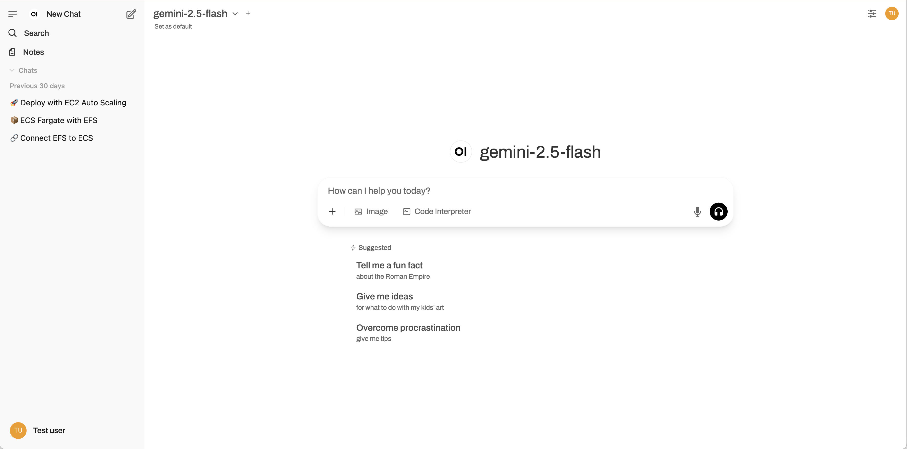

# Open WebUI User Guide

## Table of contents

<!-- TOC -->

- [Table of contents](#table-of-contents)
- [Introduction](#introduction)
- [Presentation of the UI](#presentation-of-the-ui)
    - [Main layout sections](#main-layout-sections)
    - [Detailed components](#detailed-components)
        - [I. Left sidebar (navigation & history)](#i-left-sidebar-navigation--history)
        - [II. Chat area](#ii-chat-area)
        - [III. User Menu & Settings](#iii-user-menu--settings)
- [Chat features](#chat-features)
- [Chat parameters](#chat-parameters)
- [List of models](#list-of-models)
    - [Text generations models](#text-generations-models)
    - [Text-to-image model](#text-to-image-model)
    - [Speech-to-text model](#speech-to-text-model)
    - [Text-to-speech model](#text-to-speech-model)
- [Workspace](#workspace)
- [User settings](#user-settings)
    - [Change language](#change-language)
- [Tips](#tips)
    - [Avoid unnecessary long conversations](#avoid-unnecessary-long-conversations)
    - [Choose the right model](#choose-the-right-model)
    - [Generate multiple responses](#generate-multiple-responses)
    - [Use system prompts](#use-system-prompts)
    - [Adjust the temperature](#adjust-the-temperature)
    - [Web search](#web-search)
- [FAQ](#faq)

<!-- /TOC -->

## Introduction

Welcome to our AI platform powered by **Open WebUI** !
 
Our application allows you to chat with the most powerful LLMs (Large Language Models) on the market.
Think of it as your personal, **private chatbot**, similar to tools like ChatGPT, but with key advantages such as the access to a variety of cutting-edge AI models and the control of their parameters.

**How to Use It:**
Simply start typing your questions or instructions in the chat area.

> [!NOTE]
> * While powerful, AI models are still tools. Always verify critical information provided by the AI, especially for sensitive or factual tasks.
> * The AI's knowledge cut-off varies by model. For the most up-to-date information, it's always best to consult current sources.
> * We will be continually improving and expanding the capabilities of this platform. Your feedback is valuable!

Enjoy the app !

## Presentation of the UI

Here is an example of what the user interface look like:

### Main layout sections

The interface is divided into three main vertical sections:

1.  **Navigation & history:** On the left, providing navigation and access to past conversations.
2.  **Chat area:** The large central area where the conversation with the AI takes place.
3.  **User menu & settings:** On the upper right, housing user-specific actions and overall application settings.

### Detailed components

#### I. Left sidebar (navigation & history)

1.  **Hamburger Menu Icon (☰):** At the very top left, used to collapse or expand the sidebar for more screen space.
<2.  **Open WebUI Logo (`OI`):** The branding or icon for the application.>
3.  **"New Chat" Button:** A prominent button to initiate a new conversation, clearing the context from the previous one.
5.  **Search bar (🔎):** Allows users to search through their conversation history.
6.  **Notes (📄):** A section for managing user notes, distinct from chats.
7.  **Workspace:** provides a comprehensive environment for managing your AI interactions and configurations. It consists of three key components: Models, Knowledge, and Prompts. See the [Workspace](#workspace) section for more details.
8.  **"Chats" section header:** A collapsible section indicating the list of saved conversations.
11. **User profile section:**
    *   **User avatar/initials (`TU` in an orange circle):** Represents the logged-in user.
    *   **User name ("Test User"):** Displays the name of the logged-in user.

#### II. Chat area

1.  **Model selection/Current Model Display:**
    *   **Model name:** Shows the AI model currently selected for the conversation.
    *   **Dropdown arrow:** Indicates that clicking this allows the user to select a different AI model.
    *   **"Set as default" text:** An option to designate the currently selected model as the default for future chats.
<!--
3.  **Chat Display Area (Conversation History - currently empty/initial state):**
    *   **Open WebUI Logo (`OI`):** Central branding.
    *   **Model Name ("gemini-2.5-flash"):** Reinforces which model is being used.
    *   **Placeholder Message ("How can I help you today?"):** The initial greeting from the AI, indicating it's ready for a prompt. This is where the messages from both the user and the AI would appear as the conversation progresses.
-->
4.  **Message Input Area:**
    *   **Text Input Box:** The large box where the user types their messages. It contains the placeholder "How can I help you today?" which would disappear upon typing.
    *   **Attachment/Options Button (+):** At the bottom left of the input box, opens options to attach files (like images) or access more advanced input features.
    *   **"Image" Button (Image Icon):** For generating an image from the user message.
    *   **"Code Interpreter" Button:** For executing code.
    *   **Microphone Icon (🎤︎︎):** For voice input. A speech-to-text model will transcribe the user's voice message and send it to the LLM. 
    *   **Headphones Icon (🎧):** For voice conversation. This option allows the user to chat with the AI model verbally.
5.  **Suggested Prompts:** Example questions provided by the UI to help users get started (e.g., "Overcome procrastination", "Tell me a fun fact", "Explain options trading").

#### III. User Menu & Settings

1.  **User avatar/initials (at the top right):** when clicked on, a dropdown menu appears with the following elements:
    *  **Settings (⚙️):** Opens the application's general settings panel.
    *   **Archived chats:** For managing conversations that have been moved out of the main chat list.
    *   **Playground:** A dedicated area for experimenting with AI models, potentially with more advanced parameters and configurations.
    <*   **Admin panel:** For administrative controls.>
    *   **Documentation:** Links to Open WebUI's official documentation.
    *   **Releases:** Provides information about software versions and updates.
    *   **Keyboard shortcuts:** Displays a list of hotkeys for faster navigation and interaction.
    *   **Sign Out:** To log out of the application.
2.  **Chat controls:** Let users can modify the system prompt and advanced parameters for a specific chat instance. Requires a little bit of knowledge about LLMs.
3.  **Chat settings (•••)**: Only appears after starting a conversation. It allows the user to:
    * **Share** the conversation.
    * Get an **Overview** of the chat and easily move around it.
    * **Download** the chat in different formats.
    * **Copy** the content of the chat.
    * Add tags to the chat. Some tags are automatically generated by a LLM when the conversation starts.

## Chat features

Here is a non-exhaustive list of the features offered in the chat:
- Select one or multiple models.
- Change the model within the same chat.
- Click on the **+** (More) button at the bottom of the input text field to **Upload** files and chat about them.
- Click on the **+** (More) button at the bottom of the input text field to take a **Capture** (or multiple captures) of your screen, tab, or window and chat about it.
- Click on **Image** below the input text field to generate an image from your prompt.
- Click on **Code interpreter**  below the input text field to ask the model to generate and execute code in a sandbox environment.
- Click on the **microphone** icon at the bottom right of the input field to enter your prompt verbally. A speech-to-text model will transcribe your voice input (see [Speech-to-text model](#speech-to-text-model)) and send it to the LLM.
- Click on the **headphone** icon to the right of the microphone icon to start an oral conversation with the model.
Here is how it works:
    - A speech-to-text model will transcribe your voice input (see [Speech-to-text model](#speech-to-text-model));
    - The transcribed prompt is sent to the LLM;
    - The LLM generates its response;
    - A text-to-speech model reads aloud the LLM's response (see [Text-to-speech model](#text-to-speech-model)).
- **Edit** your prompt by clicking on the edit icon below your message and generate a new answer from the LLM.
- **Edit** the LLM's response by clicking on the edit icon below the message.
- **Copy** your prompt or the model's response by clicking on the copy icon below the message.
- **Read aloud** the LLM's response by clicking on the speaker icon below the message.
- (Not recommended) **Generate an image** from the LLM's response by clicking on the image icon below its message. It is recommended to generate an image directly from your prompt instead.
- **Evaluate** the LLM's response by giving it a thumbs-up or thumbs-down.
- **Grade** the LLM's response on a scale of 1 to 10 and explain your grade with a short sentence (optional).
- Extend the LLM's response by clicking on the **play** icon (**Continue response**).
- **Regenrate** the LLM's response using the **reload** icon. You can change the model before regenerating to have a response from this newly selected LLM.
<!-- - Highlight text in the response to **Ask** a question about the highlighted text or directly ask the LLM to **Explain** it.-->
- Click on **Controls** at the top right of your screen to configure the system prompt and advanced parameters of the LLM (see [Chat parameters](#chat-parameters)).
- Once a conversation has started, you can click on the **three dots (•••)** at the top right of the screen, next to Controls, to:
    - **Share** the chat via an URL.
    - Get an **Overview** and easily move along the chat.
    - **Download** the chat in different formats (json, txt or pdf).
    - **Copy** the entire conversation.
    - Add **tags** to the chat or modify them.
- You can also click on the **three dots (•••)** in the left panel next to the chat's title to **pin**, **rename**, or **archive** the conversation, as well as having access to the options mentioned just before.

## Chat parameters

## List of models

### Text generations models

Text generation models are commonly called LLMs for Large Language Models.
The LLMs available in the application are listed in the table below.
The **Input Type** column indicates the format accepted by the model, which can be text, image, audio, video, or a combination of these four.
For example, some models only accept text as input, while others accept both text and images.
Therefore, if you attempt to provide an image to a model that only accepts text, you will receive an error.
Refer to the table to confirm whether the model you are using accepts the data type you wish to send.

**Note:** When using voice input or voice conversation (see [II. Discussion Area](#ii-zone-de-discussion)), a separate, dedicated model handles the transcription of your spoken message into a written one. This means you can use these features regardless of the specific model you are interacting with. However, you cannot attach an audio file directly if the model does not accept audio as input.

### Text-to-image model

### Speech-to-text model

### Text-to-speech model

## Workspace

## User settings

You can access the user settings by clicking on your avatar/initials at the top right or at the bottom left of the screen and then selecting **⚙️ Settings**.

### Change language

To change the language, go to **Settings -> General -> Language** and select your preferred language.

## Tips

### Avoid unnecessary long conversations

### Choose the right model

### Generate multiple responses

### Use system prompts

### Adjust the temperature

### Web search

## FAQ

**Why can't I open the application in my browser?**
 
Try to delete browsing data, at least from the last time you succeeded to connect to the app.

